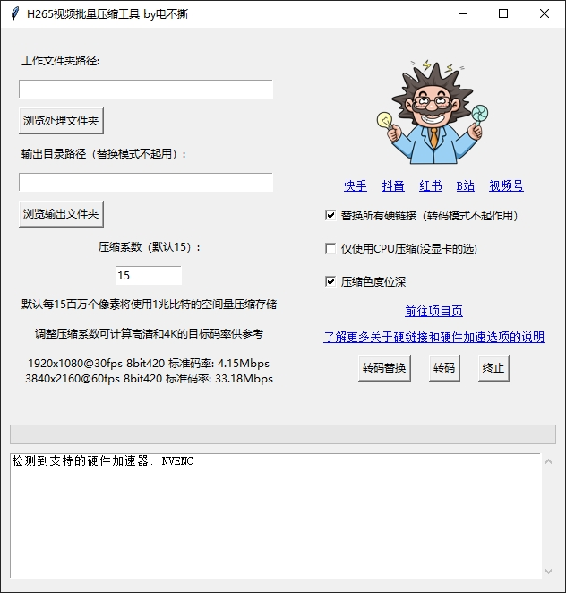

# FilmProductionTools
目前做了一个，win平台下基于FFmpeg的H265视频批量压缩工具。

## 简介

这个工具集包含多个实用的媒体处理工具：

- **视频批量压缩工具**：通过计算目标码率来优化视频文件大小，同时保持视频质量，支持自定义压缩系数调整压缩程度。
- **重复视频查找工具 (Fduplicate.py)**：递归扫描目录中的视频文件，通过比较视频时长、帧率和帧内容来识别重复视频。
- **文件名精简工具 (filename_reducer.py)**：通过删除文件名中的指定字符串来批量精简文件名，支持递归处理子文件夹。
- **媒体文件处理器 (media_processor.py)**：可以读取和修改媒体文件的创建时间，支持时间校准功能。
- **视频样本收集工具 (video_sampler.py)**：用于收集不同编码格式、色彩格式的视频样本，便于后续媒体工具转码测试工作。

直接用：

    dist/H265视频批量压缩工具 by电不撕.exe

ps：单文件直接拷走随便用，下面的运行方式可以不用看

exe合集的网盘地址： 
[度盘fj6m](https://pan.baidu.com/s/1QkaOBqF6g4-WgIuB2v3lCA?pwd=fj6m)
[夸盘4sha](https://pan.quark.cn/s/ea1a1eb0f578)

    度盘：链接后缀【1QkaOBqF6g4-WgIuB2v3lCA】提取码【fj6m】
    夸盘：链接后缀【ea1a1eb0f578】提取码【4sha】

## 主要选项

- **GPU or CPU**：可选CPU压缩，默认CUDA显卡加速压缩，其他家显卡还在写，使用cpu压缩h265是很慢的。
[了解更多关于硬件编解码](https://trac.ffmpeg.org/wiki/HWAccelIntro)

- **硬链接替换 or 纯文件替换**：可选替换所有硬链接副本，如不勾选则只替换当前文件这个一个副本。
[了解更多关于硬链接](https://learn.microsoft.com/zh-cn/windows/win32/fileio/hard-links-and-junctions)

      硬链接是文件的文件系统表示形式，其中多个路径引用同一卷中的单个文件。

- **压缩色度位深**：可选择保留像素色彩格式和位深。
[了解更多关于像素色彩格式 @影视飓风](https://www.bilibili.com/video/BV1ds411T7F4/)

      当取消勾选压缩色彩，会在压缩文件中保留yuv422、10bit等设置，增加标准比特率的计算倍率。
      当取消勾选压缩色彩，会在压缩文件中强行使用yuv420 8bit格式。

- **转码替换**：是真的会替换！数据无价谨慎操作！

- **log和进度条**：处理结果实时显示报告，在处理完毕后会生成完整TXT报告，进度条展示的是全文件夹的处理进度按文件个数计算，不是单个文件进度。

## 主要功能

- **自动检测视频信息**：包括分辨率、帧率、比特率等。
- **计算目标码率**：根据视频的像素数量和帧率动态计算目标码率。
- **支持多种编码格式**：使用硬件加速（如NVIDIA NVENC）进行高效压缩。
- **二次压缩选项**：在首次压缩失败时尝试二次压缩。
- **跳过特定格式**：包含alpha通道或使用ProRes 4444编码的视频将被跳过。
- **可选覆盖**：可以直接覆盖源文件以节约空间，亦可将转码视频按照原文件夹结构放到制定目录。
- **记录日志**：生成跳过的文件、失败的文件和二次成功压缩的文件的日志。

## 使用步骤

**安装依赖库**

   打开终端或命令提示符并运行以下命令安装所需的Python库：
    pip install -r requirements.txt -i https://mirrors.aliyun.com/pypi/simple/

**准备工作文件夹**

   将需要压缩的视频文件放入一个单独的工作文件夹中,程序会处理文件夹中所有文件和子文件夹中所有文件，包含如下格式：

    ('.mp4', '.mkv', '.avi', '.m4v', '.mpg', '.mts', '.ts', '.mov', '.mxf', '.webm', '.flv', '.f4v', '.wmv')

**运行脚本**

    video_compressor.py

**输入参数**

   工作文件夹路径：输入存放视频文件的文件夹路径。

   压缩系数（可选，默认值为15）：输入压缩系数，单位为“兆”。默认情况下，每15兆的像素将使用1兆比特的数据量存储。例如：

    一个4K60帧视频在压缩系数15兆的编码下标准码率为34Mbps。

    一个1080p30帧视频在压缩系数15兆的编码下标准码率为5Mbps。

    划重点：值越大画质越渣，值越小文件越大！

**查看结果**

   【注意！！】压缩后的视频文件将覆盖原始文件（包含所有硬链接）。【注意！！】

   脚本会在工作文件夹中生成三个日志文件，如果没有产生相关记录则不会生成相关txt：

    skipped_files_<timestamp>.txt：记录跳过的文件信息。

    failed_files_<timestamp>.txt：记录压缩失败的文件信息。

    secondary_success_files_<timestamp>.txt：记录通过二次压缩成功的文件信息。

**二次开发**

   生成exe文件需要用到PyInstaller：

    pip install pyinstaller -i https://mirrors.aliyun.com/pypi/simple/

   配置环境变量

    默认情况下，Python 的 Scripts 目录位于 C:\Users\<YourUsername>\AppData\Local\Programs\Python\PythonXX\Scripts 或 C:\Program Files\PythonXX\Scripts。

    将此路径添加到系统的 PATH 环境变量中。

   使用 PyInstaller 生成一个 .spec 文件，然后手动编辑这个文件以包含 bin 文件夹中的FFmpeg二进制文件。
   
    pyinstaller --onefile --windowed video_compressor_gui.py

## 关注我

**点赞 收藏 散会**

[快手](https://v.kuaishou.com/5eo8Cv)
[抖音]( https://v.douyin.com/CeiJMCp3o)
[小红书](https://www.xiaohongshu.com/user/profile/60ed03f7000000000100bf52)
[哔哩](https://b23.tv/jITjmL8)

